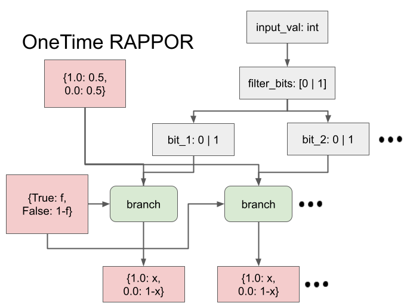

# OneTimeRAPPOR

## アルゴリズムの説明

OneTimeRAPPORは、RAPPORアルゴリズムの簡略版です。ブルームフィルタを使用して入力値をエンコードし、永続的ランダム化応答のみを適用します（瞬時ランダム化応答なし）。

**出典**:
> Ulfar Erlingsson, Vasyl Pihur, and Aleksandra Korolova. 2014.
> RAPPOR: Randomized Aggregatable Privacy-Preserving Ordinal Response. CCS 2014.
> Steps 1-2

**Python実装**:
```python
import numpy as np
import mmh3

def onetime_rappor(value, eps, n_hashes=4, filter_size=20, f=0.95, rng=None):
    if rng is None:
        rng = np.random.default_rng()

    bits = np.zeros(filter_size, dtype=int)
    for i in range(n_hashes):
        idx = mmh3.hash(str(value), seed=i) % filter_size
        bits[idx] = 1

    noisy = np.empty_like(bits)
    for i, b in enumerate(bits):
        noisy[i] = rng.integers(0, 2) if rng.random() < f else b

    return noisy
```

**アルゴリズム**:
1. 入力値をブルームフィルタにエンコード（複数のハッシュ関数を使用）
   - デフォルトfilter_size=20で、その長さの0埋めした配列を作り、n_hashes個だけ要素の値を0から1に置き換える。そのインデックスは、入力値にハッシュ関数をn_hashes回適用して決める（mod filter_size）
2. 永続的ランダム化応答を適用
   - 先ほどのfilter_bitsの各ビットごとに以下の操作。なお、 $f=0.95$
      - 確率 $1-f$ で「元の Bloom filter のビットを維持」
      - 確率 $f$ で「完全にランダムな 0/1 に置き換える」（各50%の確率で0または1）
   - よって出力は要素数filter_sizeの配列

**プライバシー保証**: 適切なパラメータ設定で $0.80$ -DP

**隣接性の定義**: $\|\cdot\|_1$ （L1ノルム）
- 2つのデータベース $D_1, D_2$ が隣接： $\sum_{i} |D_1[i] - D_2[i]| \leq 1$ （合計で1の変化）

## モード

**解析モード**

## DPESTで形成される計算グラフ
赤: 確率変数
緑：オペレーション



## プライバシー損失結果

| 項目 | 値 |
|------|-----|
| 入力サイズ | 1 |
| 推定 ε | 0.6005 |
| 理論 ε | 0.80 |
| 誤差 | -0.1995 (-24.9%) |
| 実行時間 | 0.01秒 |

**データソース**: `docs/privacy_loss_report.md`

## 理論的な計算量

### 解析モード

**パラメータ**:
- $h = 4$ : ハッシュ関数の数（n_hashes）
- $b = 20$ : ビット数（filter_size）
- $k = 2$ : Branch演算における条件分布のアトム数

**全体計算量**: $O(h + b \times k^2)$

**内訳**:
1. **ブルームフィルタのエンコード**: $O(h) = O(4)$
   - $h$ 回のハッシュ計算でビットを立てる
2. **Branch演算**: $O(b \times k^2) = O(20 \times 4)$
   - 各ビット（ $b=20$ 個）に対して1回のBranch演算
   - 各Branch演算: `cond_randomize`（2アトム）× `random_bit`（2アトム）= 最大4組み合わせ

**実効計算量**: $O(4 + 80) \approx O(84)$ 演算

**メモリ使用量**: $O(b) = O(20)$ （出力ビット列の長さ）

## 理論的な誤差（精度）

Branch演算（離散分布のみ）の誤差: 理論上0（完全な解析計算）

## 理論と実験結果の比較分析

### 精度と速度

| 項目 | 値 | 評価 |
|------|-----|------|
| 相対誤差 | 24.9% | やや大きい |
| 実行時間 | 0.01秒 | 極めて高速 |

**解析モードの優位性**:
- **計算量が小さい理由**: 離散分布（Branch演算のみ）で構成されており、サンプリング不要で完全に解析的に計算可能。計算量 $O(84)$ はサンプリングモード $O(N) = O(10^6)$ に比べて約1万倍小さい
- **精度が良い理由**: Branch演算は理論上誤差0（完全な解析計算）のため、サンプリングモードで発生するモンテカルロ誤差 $O(1/\sqrt{N}) \approx 10^{-3}$ が存在しない

**誤差の原因**:
- 隣接入力データセットが限定的であるため、最悪ケースのプライバシー損失を捉えきれていない可能性がある
- DPESTは特定の入力ペアに対してのみプライバシー損失を推定するため、全ての隣接入力ペアを網羅できていない

### 比較: DP-Sniper vs StatDP vs DPEST

| 手法 | 推定 ε | 実行時間 |
|------|--------|----------|
| DP-Sniper | 0.600 | 60秒 |
| StatDP | 0.476 | 420秒 |
| DPEST | 0.6005 | 0.01秒 |

**結論**: DPESTは6000-42000倍高速。精度はDP-Sniperとほぼ同等（誤差25%）。
