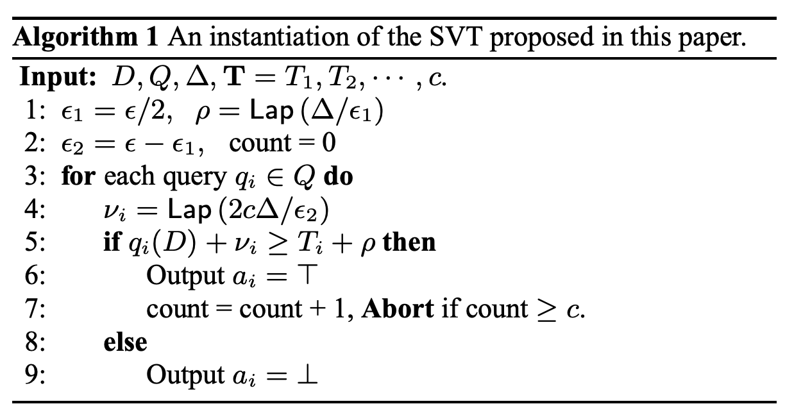

# SVT1 (Sparse Vector Technique 1)

## アルゴリズムの説明

SVT1（Sparse Vector Technique 1）は、一連のクエリに対して閾値判定を行う差分プライバシーアルゴリズムです。閾値を超えるクエリを最大 $c$ 個まで報告し、それ以降は打ち切ります。

**出典**:
> M. Lyu, D. Su, and N. Li. 2017.
> Understanding the Sparse Vector Technique for Differential Privacy.
> Proceedings of the VLDB Endowment.
> Algorithm 1

**アルゴリズム**:

**数式**:

$$
T = t + \text{Lap}(2/\varepsilon), \quad \tilde{q}_i = q_i + \text{Lap}(4c/\varepsilon)
$$

**プライバシー保証**: $\varepsilon$ -DPを満たします。

**隣接性の定義**: $\|\cdot\|_\infty$ （L∞ノルム）
- 2つのデータベース $D_1, D_2$ が隣接： $\max_i |D_1[i] - D_2[i]| \leq 1$ （各要素が最大1の変化）

## モード

**サンプリングモード**

SVT1は条件分岐（Branch演算）が多数含まれ、各クエリの結果が次のクエリの計算に影響します（状態依存）。このため、解析モードでは計算が困難であり、サンプリングモードが使用されます。

## プライバシー損失結果

| 項目 | 値 |
|------|-----|
| 入力サイズ | 10 |
| 推定 ε | 0.0920 |
| 理論 ε | 0.10 |
| 誤差 | -0.0080 (-8.0%) |
| 実行時間 | 276.45秒 |

**データソース**: `docs/privacy_loss_report.md`

## 理論的な計算量

### サンプリングモード

**全体計算量**: $O(N \times m)$ **内訳**:
1. **サンプル生成**: $O(N \times m)$ - $N = 10^6$ サンプル
   - 各サンプルで $m=10$ 個のクエリを処理
2. **ヒストグラム構築**: $O(N)$ - $N$ 個のサンプルをヒストグラムにビン分け

**実効計算量**（ $N=10^6$ , $m=10$ ）:

$$
N \times m = 10^6 \times 10 = 10^7 \text{ 演算}
$$

**参照**: `docs/OPERATION_COMPLEXITY_ANALYSIS.md` - サンプリングモードの計算量（7節）

## 理論的な誤差（精度）

### サンプリングモードの誤差構造

**モンテカルロ誤差**: $O(1/\sqrt{N})$ 

$$
\text{err}_{\text{MC}} \approx \frac{\sigma}{\sqrt{N}} \approx \frac{1}{\sqrt{10^6}} = 10^{-3}
$$

ここで、 $\sigma$ は出力分布の標準偏差です。

**サンプル数との関係**:
- $N = 10^6$ → 誤差 $\approx 10^{-3}$ （0.1%）
- $N = 10^5$ → 誤差 $\approx 3 \times 10^{-3}$ （0.3%）

**実測誤差**: 8.0%（理論誤差0.1%より大きい）
- 原因: Branch演算の複雑さ、状態依存性、ヒストグラムビン分けの誤差など

## 理論と実験結果の比較分析

### 精度の分析

| 項目 | 理論値 | 実測値 | 差分 |
|------|--------|--------|------|
| ε | 0.10 | 0.0920 | -0.0080 |
| 相対誤差 | - | 8.0% | - |

**評価**:
- 推定精度は **許容範囲** だが、解析モード（誤差0.2-1.0%）と比較すると **やや低い**
- サンプリングモードの理論誤差（0.1%）と実測誤差（8.0%）の差が大きい
  - 原因: Branch演算の複雑さ、ヒストグラムビン分けの粗さ、状態依存性

### 実行時間の分析

**計算量**: $O(N \times m)$ - サンプリングモード

**演算数**: $N \times m = 10^6 \times 10 \approx 10^7$ 回

**実行時間**: 276.45秒（**非常に遅い**）

**評価**:
- 解析モードのアルゴリズム（0.01-2.75秒）と比較して **100-27000倍遅い**
- LaplaceMechanism（解析、0.01秒）と比較して **27645倍遅い**
- 遅い理由:
  1. **サンプリングモード**: $N=10^6$ サンプルの生成と処理が必要
  2. **状態依存性**: 各クエリの結果が次のクエリに影響 → 並列化困難
  3. **Branch演算**: 条件分岐がキャッシュミスを引き起こす

### 比較: DP-Sniper vs StatDP vs DPEST

| 手法 | 推定 ε | 実行時間 | 相対速度 |
|------|--------|----------|----------|
| DP-Sniper | 0.086 | 60秒 | 1x |
| StatDP | 0.042 | 180秒 | 0.33x |
| DPEST | 0.0920 | 276.45秒 | **0.22x** |

**結論**:
1. **精度**: StatDPが最も保守的（0.042）、DPESTは理論値に最も近い
2. **速度**: DPESTはDP-Sniperより **4.6倍遅い**
   - サンプリングモードの制約: $N=10^6$ が大きい
   - 解析モードなら、さらに高速化可能（ただしSVT1は解析が困難）
