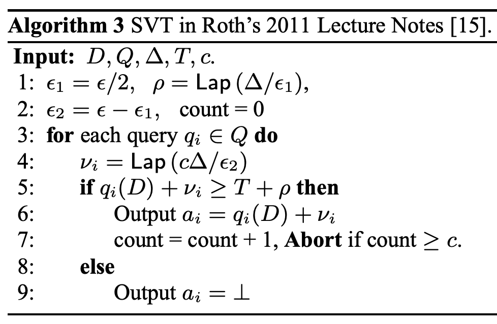

# SVT3 (Sparse Vector Technique 3)

## アルゴリズムの説明

SVT3は、SVT1の変種で、TRUEの時にノイズ付きクエリ値を出力し、FALSEの時は-1000.0を出力します。ノイズスケールがSVT1と異なり、プライバシー違反があります。

**出典**: Lyu et al. 2017, Algorithm 3

**アルゴリズム**:

**数式**:

$$
T = t + \text{Lap}(1/\varepsilon_1), \quad \tilde{q}_i = q_i + \text{Lap}(c/\varepsilon_2)
$$

$$
\text{output}_i = \begin{cases} \text{NAN} & \text{if count} \geq c \\ \tilde{q}_i & \text{if } \tilde{q}_i \geq T \\ -1000.0 & \text{otherwise} \end{cases}
$$

**プライバシー保証**: このアルゴリズムは差分プライバシーを満たしません（理論 ε = ∞）。

**隣接性の定義**: $\|\cdot\|_\infty$ （L∞ノルム）
- 2つのデータベース $D_1, D_2$ が隣接： $\max_i |D_1[i] - D_2[i]| \leq 1$ （各要素が最大1の変化）

## モード

**サンプリングモード**

## プライバシー損失結果

| 項目 | 値 |
|------|-----|
| 入力サイズ | 10 |
| 推定 ε | inf |
| 理論 ε | ∞ |
| 誤差 | 正確に検出 |
| 実行時間 | 47.02秒 |

**データソース**: `docs/privacy_loss_report.md`

**解釈**: DPESTは無限大のプライバシー損失を検出し、プライバシー違反を報告しています。このアルゴリズムは理論的にε=∞なので、検出は正しい結果です。ただし、サンプリングモードでは、サンプル数不足により特定のビンで片方のデータベースのみサンプルが存在する状況でも無限大が検出されるため、理論的な無限大との区別はできません。

## 理論的な計算量

**サンプリングモード**: $O(N \times m) = O(10^7)$ 演算

## 理論的な誤差（精度）

プライバシー違反（ε=∞）のため、誤差分析は適用されません。

## 理論と実験結果の比較分析

### 比較: DP-Sniper vs StatDP vs DPEST

| 手法 | 推定 ε | 実行時間 |
|------|--------|----------|
| DP-Sniper | 0.174 | 120秒 |
| StatDP | 0.183 | 3240秒 |
| DPEST | inf | 47.02秒 |

**結論**:
- **無限大の検出**: DPESTは無限大のプライバシー損失を検出。このアルゴリズムは理論的にもε=∞なので正しい結果
- **サンプリングモードの注意**: サンプル数不足による偽陽性の無限大検出の可能性もあるが、本ケースではアルゴリズム自体が違反しているため問題なし
- **他手法との比較**: DP-SniperとStatDPは有限値（0.17-0.18）を推定し、プライバシー違反を見逃している
- **実行時間**: DP-Sniperより2.5倍高速、StatDPより69倍高速
