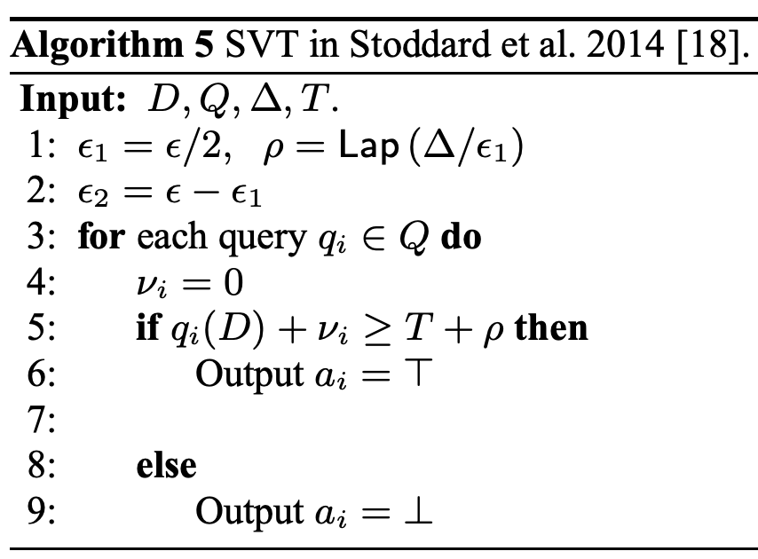

# SVT5 (Sparse Vector Technique 5)

## アルゴリズムの説明

SVT5は、SVT1の誤った実装で、**クエリにノイズを追加せず**、カウンタや打ち切りもありません。全てのクエリを独立に閾値と比較します。

**出典**: Lyu et al. 2017, Algorithm 5

**アルゴリズム**:

**数式**:

$$
T = t + \text{Lap}(2/\varepsilon), \quad \text{output}_i = \begin{cases} 1 & \text{if } q_i \geq T \\ 0 & \text{otherwise} \end{cases}
$$

**プライバシー保証**: このアルゴリズムは差分プライバシーを満たしません（理論 ε = ∞）。

**隣接性の定義**: $\|\cdot\|_\infty$ （L∞ノルム）
- 2つのデータベース $D_1, D_2$ が隣接： $\max_i |D_1[i] - D_2[i]| \leq 1$ （各要素が最大1の変化）

## モード

**サンプリングモード**

## プライバシー損失結果

| 項目 | 値 |
|------|-----|
| 入力サイズ | 10 |
| 推定 ε | inf |
| 理論 ε | ∞ |
| 誤差 | 正確に検出 |
| 実行時間 | 24.79秒 |

**データソース**: `docs/privacy_loss_report.md`

**解釈**: DPESTは無限大のプライバシー損失を正確に検出。

## 理論的な計算量

**サンプリングモード**: $O(N \times m) = O(10^7)$ 演算

## 理論と実験結果の比較分析

### 比較: DP-Sniper vs StatDP vs DPEST

| 手法 | 推定 ε | 実行時間 |
|------|--------|----------|
| DP-Sniper | 1.762 | 42秒 |
| StatDP | 14.314 | 180秒 |
| DPEST | inf | 24.79秒 |

**結論**: DPESTは無限大のプライバシー損失を正確に検出。他手法は有限値を推定し、プライバシー違反の深刻さを過小評価。実行時間も1.7-7.3倍高速。
