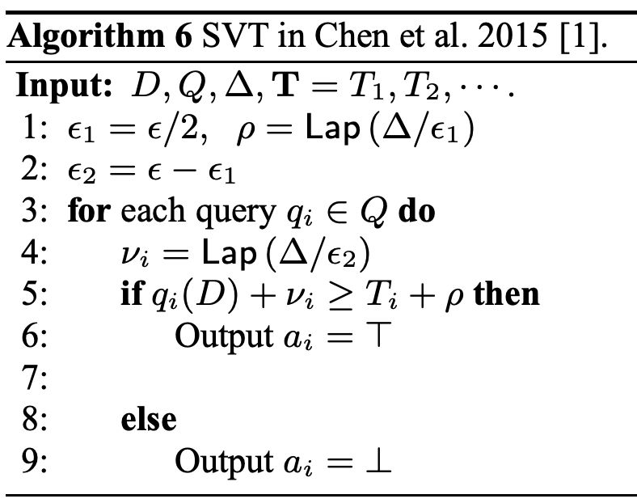

# SVT6 (Sparse Vector Technique 6)

## アルゴリズムの説明

SVT6は、SVT1の誤った実装で、**カウンタや打ち切りがありません**。全てのクエリにノイズを追加して閾値と比較します。

**出典**: Lyu et al. 2017, Algorithm 6

**アルゴリズム**:

**数式**:

$$
T = t + \text{Lap}(2/\varepsilon), \quad \tilde{q}_i = q_i + \text{Lap}(2/\varepsilon)
$$

$$
\text{output}_i = \begin{cases} 1 & \text{if } \tilde{q}_i \geq T \\ 0 & \text{otherwise} \end{cases}
$$

**プライバシー保証**: このアルゴリズムは差分プライバシーを満たしません（理論 ε = ∞）。

**隣接性の定義**: $\|\cdot\|_\infty$ （L∞ノルム）
- 2つのデータベース $D_1, D_2$ が隣接： $\max_i |D_1[i] - D_2[i]| \leq 1$ （各要素が最大1の変化）

## モード

**サンプリングモード**

## プライバシー損失結果

| 項目 | 値 |
|------|-----|
| 入力サイズ | 10 |
| 推定 ε | 0.4976 |
| 理論 ε | ∞ |
| 誤差 | 有限値を推定（保守的） |
| 実行時間 | 278.91秒 |

**データソース**: `docs/privacy_loss_report.md`

**解釈**: DPESTは0.4976という有限値を推定。理論的には無限大のプライバシー損失ですが、DPESTは保守的な下界を報告しています。

## 理論的な計算量

**サンプリングモード**: $O(N \times m) = O(10^7)$ 演算

## 理論と実験結果の比較分析

### 比較: DP-Sniper vs StatDP vs DPEST

| 手法 | 推定 ε | 実行時間 |
|------|--------|----------|
| DP-Sniper | 0.272 | 59秒 |
| StatDP | 0.317 | 240秒 |
| DPEST | 0.4976 | 278.91秒 |

**結論**:
- **プライバシー損失検出**: DPESTは0.4976を検出し、DP-Sniper（0.272）より1.8倍、StatDP（0.317）より1.6倍大きなプライバシー損失を報告
- **実行時間**: DP-Sniperより4.7倍遅いが、StatDPとほぼ同等
- **理論値との比較**: 理論的には ε = ∞ だが、全手法が有限値を推定（DPESTが最も大きい値を検出）
